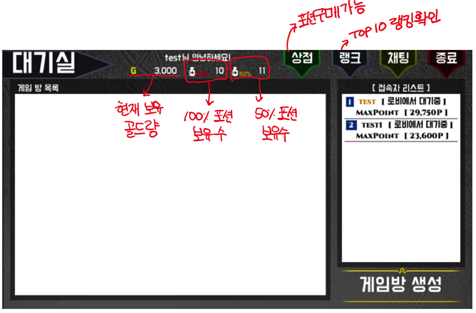
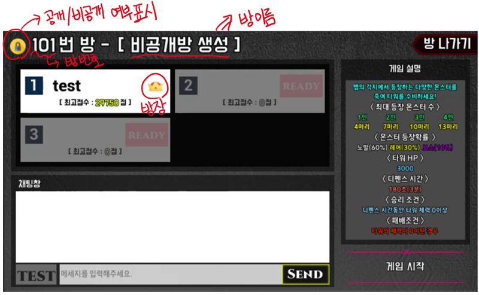
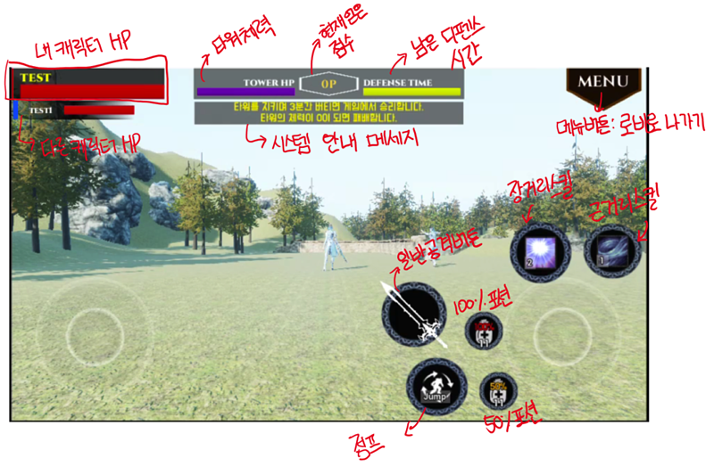

# JDefence

Unreal Engine 4를 기반으로 만든 디펜스게임입니다. 사방에서 몰려오는 적들을 무찌르며 탑을 3분동안 지키면 되는 게임입니다. 최대 4명이 동시에 플레이가 가능하며, 플레이하는 인원수에 따라 난이도가 올라갑니다. 몬스터를 무찌르면 일정 확률로 골드와 포션획득이 가능합니다.

## 주요기능

1. 상점기능

   - 100% 체력회복 포션과 50% 체력회복포션(체력의 50%만큼을 회복) 2가지 포션을 구매할 수 있습니다.

2. 랭킹기능

   - 게임플레이를 통해 얻은 최고점수를 서버에 기록해서 서버에서 가장 점수가 높은 10인을 보여줍니다.

3. 채팅기능

   - 같은 공간에 있는 플레이어들끼리 채팅이 가능합니다. 대기실에 있는 플레이어와 방에 참여하고 있는 플레이어간의 대화는 지원하지 않습니다.

4. 게임기능

   - 맵의 가운데 있는 타워를 지키는 게임입니다. 타워의 체력이 0이되면 게임에서 패배하게 됩니다.

   - 몬스터는 플레이어 수에 따라 다르게 등장합니다. 1인인 경우 4마리, 4인인 경우 13마리가 등장합니다.

   - 등장몬스터의 수는 몬스터가 유지되는 숫자입니다. 예를들어 4인플레이인 경우 항상 몬스터의 숫자가 13마리가 되도록 젠이됩니다.

   - 몬스터를 죽이면 골드와 낮은 확률로 포션을 획득할 수 있습니다.

   - 몬스터는 노멀, 레어, 보스 총 3가지종류가 존재하며, 각 몬스터가 등장하는 확률이 다릅니다.

   - 몬스터는 기본적으로 타워를 향해 이동하도록 되어있습니다. 하지만 몬스터의 탐색범위내에 플레이어가 있다면 플레이어를 따라가 공격하도록 되어있습니다.

   - 플레이어는 일반공격, 원거리스킬, 근거리스킬 총 3가지의 공격방법을 가집니다.

   - 스킬에는 쿨타임 외의 사용조건은 없습니다. 원거리는 30초, 근거리는 10초입니다.

   - 플레이어의 체력이 0이되면 사망하게 됩니다. 플레이어가 사망하면 바로 부활하거나 10초 후에 100% 회복상태로 부활할 수 있습니다. 바로 부활하는 경우엔 체력이 30%만 회복되어있습니다.

## 사용기술

[클라이언트]
- Unreal Engine 4.19
- Flatbuffer
- C++

[서버]
- Netty
- Flatbuffer
- Java
- MariaDB

## 영상

위의 이미지를 클릭하시면 영상을 보실 수 있습니다.

## 스크린샷 및 상세설명

### UI 설명

로그인 후 대기실의 모습입니다. 게임방 생성 및 상점, 랭크, 채팅 이용이 가능합니다.

게임방의 모습입니다. 최대 4명까지 플레이가 가능하며, 입장 가능 인원수에 따라 대기칸이 생성됩니다. 오른쪽 부분에서 게임 설명을 볼 수 있고, 모든 플레이어가 준비가 되면 방장 플레이어가 게임 시작을 할 수 있습니다.

게임이 시작되었을때의 모습입니다. 공격 및 스킬 사용버튼, 포션 사용 버튼이 표시되어 있고, 상단에는 캐릭터의 HP와 타워의 HP, 남은 시간 게이지와 시스템 메세지가 표시되어 있습니다.